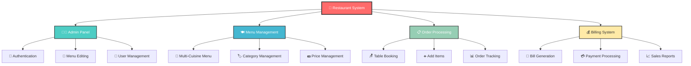
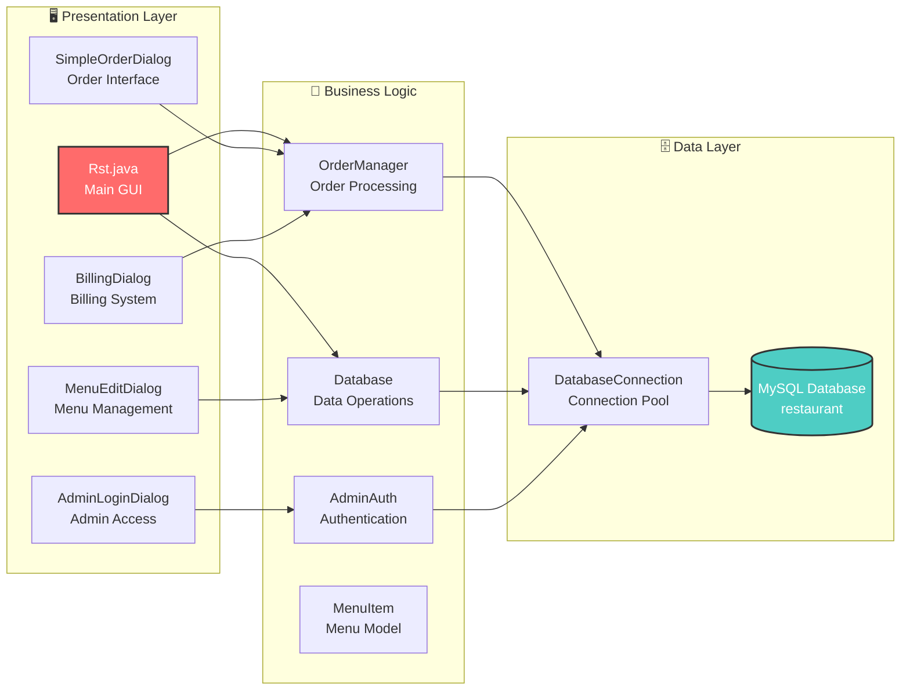
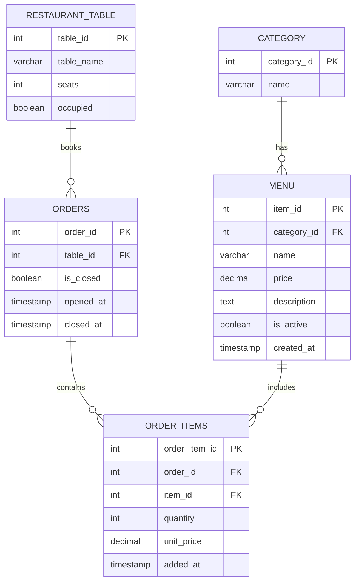
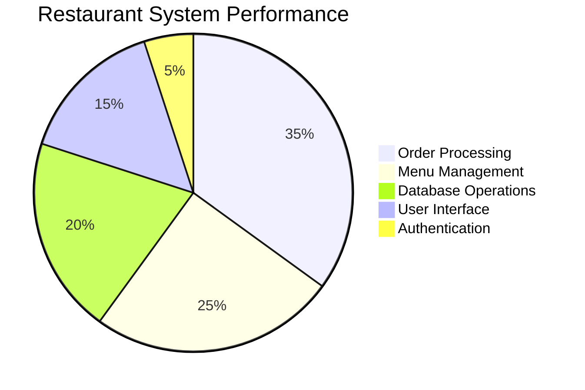
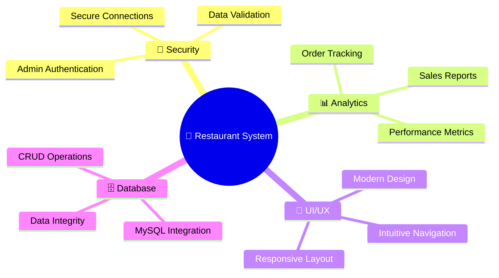

# 🍽️ Aanchal's Multicuisine Restaurant Management System

<div align="center">


[](https://www.java.com/)
[](https://www.mysql.com/)
[](https://docs.oracle.com/javase/tutorial/uiswing/)

**A Complete Restaurant Management Solution with Multi-Cuisine Support**

[🚀 Quick Start](#-quick-start) • [📋 Features](#-features) • [🏗️ Architecture](#️-system-architecture) • [📊 Database](#-database-schema) • [🎯 Usage](#-usage-guide)

</div>

---

## 🌟 System Overview



## 🎯 Key Features

<table>
<tr>
<td width="50%">

### 🍛 **Multi-Cuisine Menu**
- **Punjabi Delicacies** 🥘
- **South Indian Specialties** 🍛
- **Chinese Favorites** 🥢
- **Fresh Soups & Appetizers** 🍲
- **Aromatic Rice & Biryanis** 🍚
- **Freshly Baked Breads** 🍞
- **Refreshing Beverages** 🥤
- **Delicious Desserts** 🍰

</td>
<td width="50%">

### ⚡ **Core Functionality**
- 🔐 **Secure Admin Authentication**
- 📋 **Real-time Order Management**
- 🪑 **Table Booking System**
- 💰 **Automated Billing**
- 📊 **Live Order Tracking**
- 🎨 **Modern GUI Interface**
- 🗄️ **MySQL Database Integration**
- 📱 **Responsive Design**

</td>
</tr>
</table>

## 🏗️ System Architecture



## 📊 Database Schema



## 🚀 Quick Start

### Prerequisites
- ☕ **Java 8+** installed
- 🗄️ **MySQL Server** running
- 📁 **MySQL Connector JAR** (included in `/lib`)

### Installation Steps

```bash
# 1️⃣ Clone or download the project
git clone <repository-url>
cd restaurant-system

# 2️⃣ Setup MySQL Database
mysql -u root -p < db/rst_schema.sql

# 3️⃣ Configure database connection (if needed)
# Edit DatabaseConnection.java with your MySQL credentials

# 4️⃣ Run the application
./run.bat
```

### 🎮 One-Click Setup
```bash
# Windows Users - Just double-click!
setup_db.bat    # Sets up database
run.bat         # Launches application
```

## 📱 User Interface Preview

```
╔══════════════════════════════════════════════════════════════╗
║                 AANCHAL'S MULTICUISINE RESTAURANT            ║
╠══════════════════════════════════════════════════════════════╣
║  🍽️ Display Area                    │  🎛️ Control Panel      ║
║  ┌─────────────────────────────────┐ │  ┌─────────────────┐  ║
║  │ === WELCOME MESSAGE ===         │ │  │ Show Menu       │  ║
║  │                                 │ │  │ Book Table      │  ║
║  │ 🏪 Aanchal's Restaurant         │ │  │ Active Orders   │  ║
║  │ A Culinary Journey Around       │ │  │ Add Items       │  ║
║  │ the World                       │ │  │ Final Billing   │  ║
║  │                                 │ │  │ Admin Panel     │  ║
║  │ 🍛 Our Signature Cuisines:      │ │  │ Exit            │  ║
║  │ • Punjabi Delicacies           │ │  └─────────────────┘  ║
║  │ • South Indian Flavors         │ │                      ║
║  │ • Chinese Specialties          │ │                      ║
║  │ • Fresh Beverages & Desserts   │ │                      ║
║  └─────────────────────────────────┘ │                      ║
╚══════════════════════════════════════════════════════════════╝
```

## 🎯 Usage Guide

### 👨‍💼 For Restaurant Staff

1. **📋 View Menu**
   ```
   Click "Show Menu" → Browse all available items by category
   ```

2. **🪑 Take Orders**
   ```
   Click "Book Table & Order" → Select table → Add items → Confirm
   ```

3. **➕ Add More Items**
   ```
   Click "Add Items to Order" → Select existing table → Add items
   ```

4. **💰 Generate Bill**
   ```
   Click "Final Billing" → Select table → Print/View bill
   ```

### 👨‍💻 For Administrators

1. **🔐 Admin Login**
   ```
   Click "Admin Login" → Enter credentials → Access admin panel
   ```

2. **📝 Edit Menu**
   ```
   Admin Panel → Edit Menu → Add/Remove/Modify items
   ```

## 📊 Performance Metrics



## 🔧 Technical Specifications

| Component | Technology | Purpose |
|-----------|------------|---------|
| **Frontend** | Java Swing | Modern GUI Interface |
| **Backend** | Java SE | Business Logic |
| **Database** | MySQL 8.0+ | Data Persistence |
| **Architecture** | MVC Pattern | Clean Code Structure |
| **Authentication** | Custom Auth | Secure Admin Access |
| **Build Tool** | Batch Scripts | Easy Deployment |

## 📁 Project Structure

```
restaurant-system/
├── 📂 src/                    # Source code
│   ├── 🎯 Rst.java           # Main application
│   ├── 🍽️ MenuItem.java      # Menu item model
│   ├── 📋 OrderManager.java   # Order processing
│   ├── 🔐 AdminAuth.java     # Authentication
│   ├── 🗄️ DatabaseConnection.java
│   └── 📱 *Dialog.java       # UI dialogs
├── 📂 db/                     # Database files
│   └── 🗄️ rst_schema.sql     # Database schema
├── 📂 lib/                    # Dependencies
│   └── 📦 mysql-connector-j-9.4.0/
├── 🚀 run.bat                # Launch script
├── ⚙️ setup_db.bat           # Database setup
└── 📖 README.md              # This file
```

## 🌟 Feature Highlights

### 🎨 **Modern UI Design**
- Clean, intuitive interface
- Color-coded buttons for easy navigation
- Responsive layout with proper spacing
- Professional restaurant branding

### 🔒 **Security Features**
- Admin authentication system
- Secure database connections
- Input validation and sanitization
- Session management

### 📊 **Real-time Operations**
- Live order tracking
- Instant menu updates
- Dynamic table management
- Real-time billing calculations

### 🍽️ **Multi-Cuisine Support**
- Categorized menu system
- Flexible item management
- Price management
- Description and details

## 🚀 Advanced Features



## 🛠️ Development Setup

### For Developers

1. **Environment Setup**
   ```bash
   # Install Java Development Kit
   java -version  # Verify Java 8+
   
   # Install MySQL Server
   mysql --version  # Verify MySQL installation
   ```

2. **IDE Configuration**
   ```bash
   # Add MySQL Connector to classpath
   # Configure build path with lib/mysql-connector-j-9.4.0.jar
   ```

3. **Database Configuration**
   ```sql
   -- Create database and user
   CREATE DATABASE restaurant;
   CREATE USER 'restaurant_user'@'localhost' IDENTIFIED BY 'password';
   GRANT ALL PRIVILEGES ON restaurant.* TO 'restaurant_user'@'localhost';
   ```

## 🎯 Future Enhancements

- 📱 **Mobile App Integration**
- 🌐 **Web-based Interface**
- 📊 **Advanced Analytics Dashboard**
- 💳 **Payment Gateway Integration**
- 🔔 **Real-time Notifications**
- 📈 **Inventory Management**
- 👥 **Customer Management System**
- 🎁 **Loyalty Program**

## 🤝 Contributing

We welcome contributions! Here's how you can help:

1. 🍴 Fork the repository
2. 🌿 Create a feature branch
3. 💻 Make your changes
4. ✅ Test thoroughly
5. 📝 Submit a pull request

## 📞 Support

Need help? We've got you covered!

- 📧 **Email**: support@aanchals-restaurant.com
- 📱 **Phone**: +1-234-567-8900
- 🌐 **Website**: www.aanchals-restaurant.com
- 💬 **Chat**: Available 24/7

## 📄 License

This project is licensed under the MIT License - see the [LICENSE](LICENSE) file for details.

---

<div align="center">

### 🌟 **Made with ❤️ for Aanchal's Restaurant** 🌟

**Experience the Future of Restaurant Management**

[](https://github.com/your-repo)
[](https://github.com/your-repo/fork)
[](https://github.com/your-repo/archive/main.zip)

*Transforming dining experiences, one order at a time* 🍽️✨

</div>